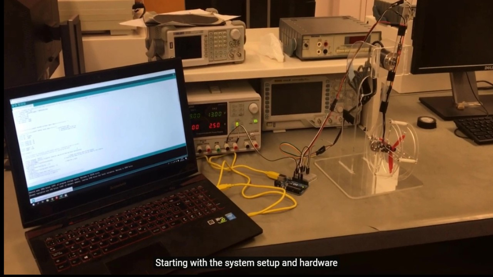
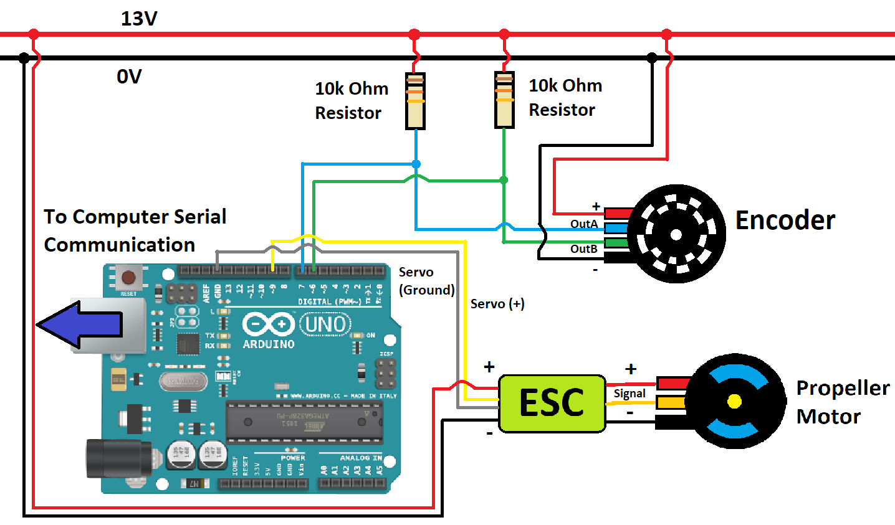

# PID-controlled-propeller-pendulum

video link: https://youtu.be/_mAuMV6Je3g

Implemented PID to control the angle of the propeller pendulum which can hold a specific angle or tracks a sinusoidal wave with resistance to disturbances. 

